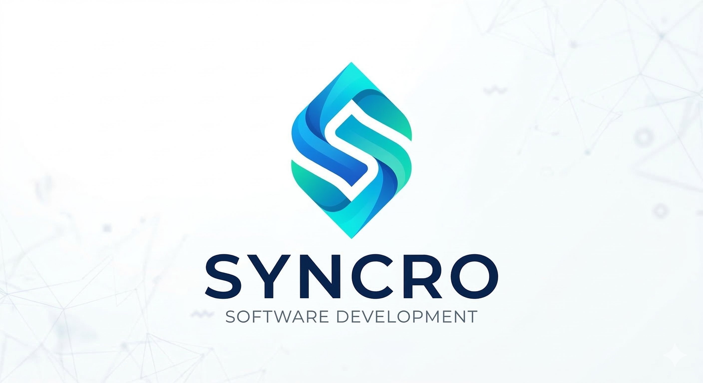

  

  <h1>🚀 Proyecto ING-2: Equipo SYNCRO</h1>
  
<em>Repositorio de Documentación</em>

  

    
    
    
  

   

---

<table width="100%">
  <tr>
    <td width="50%" align="center" valign="top">
      <h3>📖 Sobre el Proyecto</h3>
      
Sistema integral para la gestión de un centro de actividades.

       
      
    </td>
    <td width="50%" align="center" valign="top">
      <h3>👥 Integrantes</h3>
       
      <kbd>Valentín</kbd> &nbsp; <kbd>Elian</kbd> &nbsp; <kbd>Isabella</kbd>  
      <kbd>Vladimir</kbd> &nbsp; <kbd>Sebastián</kbd>
    </td>
  </tr>
</table>

---

  <h3>📂 Sobre la materia</h3>
   
  
  &nbsp; &nbsp; &nbsp;
  

