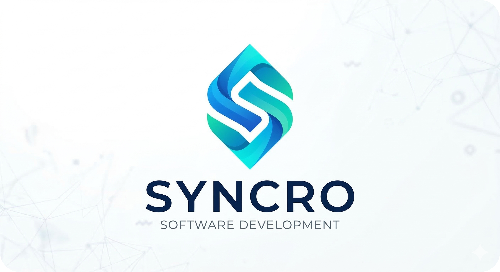

   
  
  
  <h1>
    Proyecto ING-2: Equipo SYNCRO 
  </h1>

  
<strong>Repositorio Oficial del Sistema de Gestión para Centro de Actividades</strong>

  
  

    
    
    
  

  <table width="100%">
    <tr>
      <td align="center" width="50%" valign="top">
        <h3>📖 Sobre el Proyecto</h3>
        
Desarrollo de una plataforma integral para la reserva de clases, gestión de socios y administración de pagos.

         
        
      </td>
      <td align="center" width="50%" valign="top">
        <h3>👥 Integrantes</h3>
         
        <kbd>Valentín</kbd> &nbsp; <kbd>Elian</kbd> &nbsp; <kbd>Isabella</kbd>  
        <kbd>Vladimir</kbd> &nbsp; <kbd>Sebastián</kbd>
      </td>
    </tr>
    <tr>
      <td align="center" colspan="2" valign="top">
        <h3>📂 Recursos de la Materia</h3>
        
        &nbsp;
        
      </td>
    </tr>
  </table>

