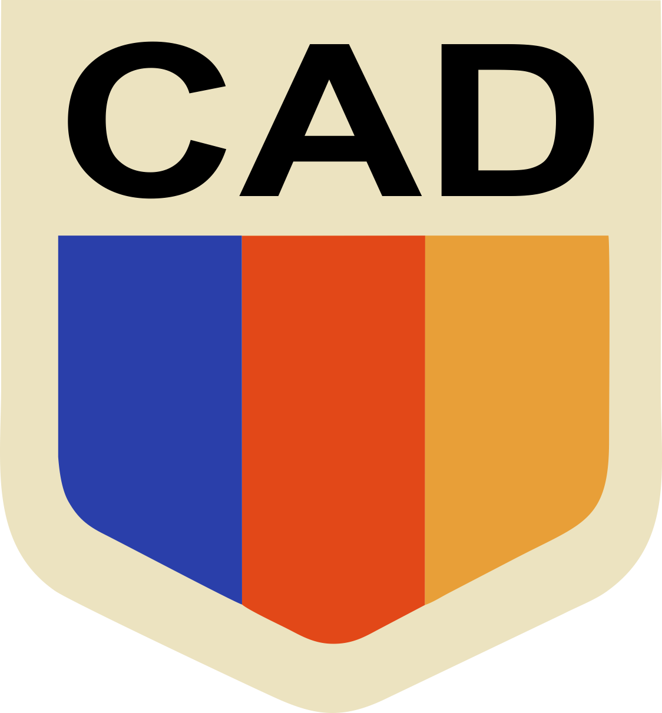

# Especificación de Requisitos de Software (SRS) y Historias de Usuario

## 1) Introducción

### a. Propósito y alcance

El propósito de este documento es definir de manera clara y detallada los requisitos funcionales y no funcionales para el desarrollo del proyecto "CAD" (Centro de Actividades Deportivas), una plataforma integral para la gestión de un centro deportivo que ofrece diversas actividades y clases.

Este documento esta dirigido a Laura y Jose, y al equipo de desarrolladores del sistema, con el proposito de establecer un base comun de entendimiento sobre los requisitos del sistema y coordinar las expectativas entre las partes involucradas.

### b. Definiciones, acrónimos y abreviaturas

-**ABONADO** Socio del centro que tiene un turno fijo asignado en una actividad específica cada mes, con beneficios como descuentos y prioridad en reservas.
-**OCASIONAL** Socio que no tiene un turno fijo asignado y reserva clases individuales.
-**SOCIO:** Usuario registrado en el sistema que puede reservar actividades y gestionar su cuenta.
-**EMPLEADO:** Usuario operativo cuyo rol está asociado a una actividad específica que puede gestionar.
-**ADMINISTRADOR:** Usuario con permisos elevados para gestionar el sistema y acceder a información sensible.
-**SEÑA:** Pago parcial requerido para reservar una clase individual.
-**CRÉDITO:** Saldo a favor del socio que puede ser utilizado para futuras reservas o cobros.
-**LISTA DE ESPERA:** Mecanismo para gestionar reservas cuando una actividad está completa, con asignación automática de cupo si se libera uno.
-**DASHBOARD:** Panel de control para el administrador con indicadores clave del negocio.
-**API:** Interfaz de Programación de Aplicaciones, utilizada para integrar servicios externos como pasarelas de pago.
-**PWA:** Aplicación Web Progresiva, una aplicación web que se comporta como una aplicación nativa en dispositivos móviles.
-**CAD:** Sistema de gestión de Centro de Actividades Deportivas.

### 1.4 Referencias

Nombre del documento | Fecha de creacion | Autor 
--- | --- | ---
[Entrevista 1](../01-Entrevistas/Entrevista-1.md) | 30/03/2026 | Syncro
[Cuestionario](../01-Entrevistas/Cuestionario.md) | 30/03/2026 | Syncro
[Entrevista 2](../01-Entrevistas/Entrevista-2.md) | 06/04/2026 | Syncro
[Epicas](../02-Epícas/Epicas.md)| 06/04/2026 | Syncro

## 2) Descripción general

### a. Resumen de la idea del producto

"CAD" es una platafroma web progresiva (PWA) diseñada para digitalizar y automatizar la gestión de un centro deportivo que ofrece múltiples actividades. 

El sistema permitirá a los socios registrarse, reservar actividades, gestionar pagos y recibir notificaciones, mientras que los empleados podrán administrar las operaciones diarias y el administrador tendrá acceso a métricas clave para la toma de decisiones estratégicas.

La plataforma distingue claramente entre roles operativos (empleados) y gerenciales (administrador), con funcionalidades específicas para cada uno, y busca reducir la carga manual mediante automatizaciones, como la gestión de listas de espera y recordatorios de pago.

Los empleados podrán gestionar actividades, turnos y asistencias mediante QR, mientras que los socios podrán reservar tanto actividades regulares como clases individuales con seña. El sistema también manejará la suspensión automática por mora y la liberación de cupos, optimizando la experiencia tanto para los usuarios como para el personal del centro. Por otro lado el administrador tendrá un dashboard con indicadores clave del negocio, como cantidad de socios activos, socios abonados vs ocasionales, entre otros que le permitirán tener una visión general del estado del centro y tomar decisiones en base a los datos.

"CAD" se concibe como una solución integral que no solo mejora la eficiencia operativa, sino que también ofrece una experiencia de usuario fluida y moderna, adaptada a las necesidades específicas de un centro deportivo.

### b. Perspectiva del producto

"CAD" es un producto independiente que no forma parte de un sistema más grande, pero que se integra con servicios externos como pasarelas de pago online y sistemas de mensajería para notificaciones. Los problemas con estos servicios externos afectarian solo parcialmente al sistema.

### c. Características de los usuarios

- Socio:
	- Registrarse e iniciar sesión.
	- Registrar un medio de pago.
	- Reservar clases.
	- Reservar una actividad.
	- Cancelar reservas.
	- Ver actividades disponibles y horarios.
	- Ver clases disponibles.
	- Recibir notificaciones de recordatorios de pago y avisos de lista de espera.
	- Confirmar asistencia a clase por estar en lista de espera.

- Empleado:
	- Iniciar sesión.
	- Gestionar actividad y sus turnos.
	- Validar asistencia por QR.
	- Registrar cobros manuales.

- Administrador:
	- Iniciar sesión.	
	- ver listado de empleados.
	- Dar de alta a un empleado.
	- Dar de baja a un empleado.
	- Modificar datos de un empleado.
	- Consultar dashboard de indicadores de negocio.

### d. Evolución previsible del sistema

- Integración con múltiples pasarelas de pago.
- Reglas dinámicas de precios/promociones.
- Analítica avanzada de ocupación y predicción de demanda.
- Integración con control de acceso físico (molinete/lector QR dedicado).

## 3) Requisitos del Software

### 3.1 Requisitos de Interfaz

#### a. Interfaz de Usuario

- La interfaz de usuario debe ser intuitiva y fácil de navegar, con un diseño responsive que se adapte tanto a pc como a dispositivos móviles.

Logo Propuesto: 

#### b. Interfaces de Software

- **Mercado Pago:** 
	* Proposito: Facilitar el proceso de pagos en linea para reservas tanto de actividades como de clases.
	* Uso: El usuario del sistema podra registrar su medio de pago (Mercado pago) y realizar pagos de seña o pagos completos para confirmar sus reservas. El sistema se integrara con la API de Mercado Pago para procesar estos pagos de manera segura y eficiente.
	* Integraciones: El sistema se comunicara con la API de Mercado Pago para gestionar la transaccion.
	* Consideraciones: La funcionalidad depende de la disponibilidad de la API de Mercado Pago, y se implementaran medidas de seguridad para proteger los datos de pago de los usuarios.

#### c. Interfaces de Hardware

- Cámara de dispositivo móvil para validación de asistencia.

### 3.2 Requisitos funcionales

- RF-01: Registrarse.
- RF-02: Iniciar sesión.
- RF-03: Cerrar sesión.
- RF-04: Recuperar contraseña.
- RF-05: Consultar listado de personal.
- RF-06: Registrar personal del centro.
- RF-07: Modificar datos del personal.
- RF-08: Dar de baja al personal.
- RF-09: Consultar listado de actividades.
- RF-10: Crear actividad deportiva.
- RF-11: Modificar actividad deportiva.
- RF-12: Dar de baja actividad deportiva.
- RF-13: Crear turnos de una actividad.
- RF-14: Modificar turno de una actividad.
- RF-15: Consultar turnos de una actividad.
- RF-16: Eliminar turno de una actividad.
- RF-17: Inscribirse a actividad en un turno específico.
- RF-18: Reservar clases individuales.
- RF-19: Confirmación de asistencia de lista espera.
- RF-20: Anotarse en lista de espera.
- RF-21: Cancelar reservas.
- RF-22: Registrar medio de pago.
- RF-23: Abonar seña de reserva.
- RF-24: Registrar cobro manual.
- RF-25: Registrar pago.
- RF-26: Registrar asistencia mediante escaneo de código QR.
- RF-27: Consultar panel de métricas.

### 3.3 Requisitos no funcionales

- RNF-01 Diseño responsive para uso en PC y dispositivos móviles.
- RNF-02 Soporte para al menos 200 usuarios activos concurrentes.
- RNF-03 Identidad visual simple y moderna orientada a velocidad operativa.

